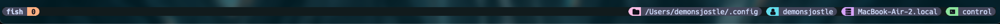
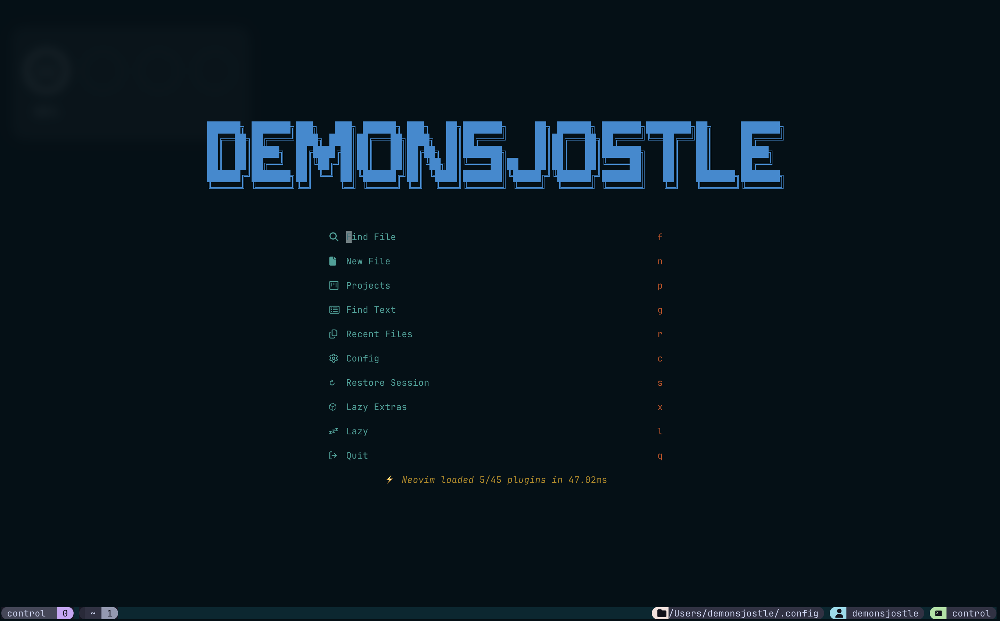

# Cool and useful settings for terminal - powerby @ [LazyVim](https://www.lazyvim.org/installation)

## OS Support
- macOS
- Linux
- Window
- WSL (Windows Subsystem for Linux)

## Configs Support
- Ghostty: version >= 1.1.3
- **Tmux**: version >= 3.3a\
*Install Tmux Plugin Manager [(TPM)](https://github.com/tmux-plugins/tpm)*
```
git clone https://github.com/tmux-plugins/tpm ~/.config/tmux/plugins
```
and then press `prefix + I` to install plugins

- **Fish Shell**: version >= 3.6.4\
*Install [Fisher](https://github.com/jorgebucaran/fisher) Plugin Manager*\
*Install [Tide](https://github.com/IlanCosman/tide)*

- **Neovim**: version >= 0.10.1\
*Install [Neovim](https://neovim.io/)*


## Note

! Please install fonts in nvim/fonts to your local fonts setting

## For Mac and Linux
```bash
    git clone https://github.com/demonsjostle/dotfiles.git ~/.config
```

## For Window

## For WSL

## Configs 

If you need to use Chat GPT in neovim. Please add API key from [OpenAI's API page](https://platform.openai.com/) to your shell enviroment.
for me use [Fish shell](https://fishshell.com/) and add API key to .config/fish/config-local.fish all using [Avante](https://github.com/yetone/avante.nvim)
```bash
    set -gx OPENAI_API_KEY [API key]
```

